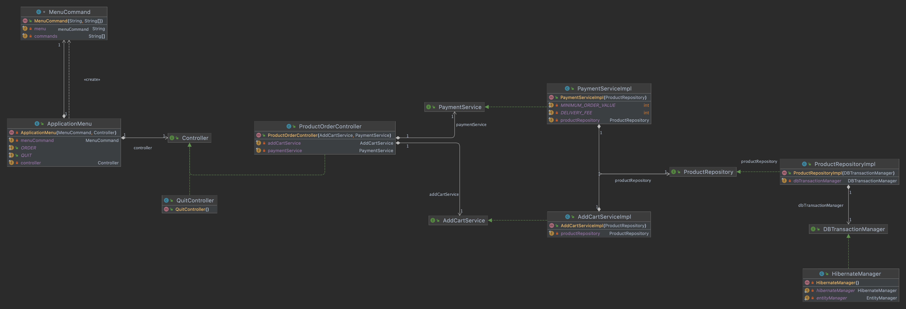
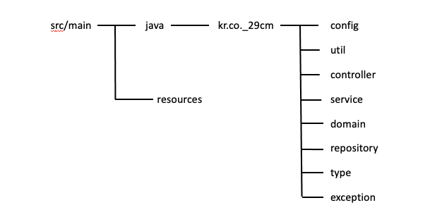

# 순수 자바로 간단한 상품 주문 프로그램 만들기 

* * *

## **🌱조건**

* Java 혹은 Kotlin 그리고 Gradle 혹은 Maven 을 사용하여 개발합니다. (_그 외 다른 프레임워크, 라이브러리는 자유롭게 사용 가능합니다._)
    * _그 외 다른 프레임워크, 라이브러리는 자유롭게 사용 가능합니다._

* * *

## **🌱요구사항**

* 상품은 고유의 상품번호와 상품명, 판매가격, 재고수량 정보를 가지고 있습니다.
* 한 번에 여러개의 상품을 같이 주문할 수 있어야 합니다.
* 상품번호, 주문수량은 반복적으로 입력 받을 수 있습니다.
    * 단, 한번 결제가 완료되고 다음 주문에선 이전 결제와 무관하게 주문이 가능해야 합니다.
* 주문은 상품번호, 수량을 입력받습니다.
    * empty 입력 (_space + ENTER_) 이 되었을 경우 해당 건에 대한 주문이 완료되고, 결제하는 것으로 판단합니다.
    * 결제 시 재고 확인을 하여야 하며 재고가 부족할 경우 결제를 시도하면 **SoldOutException** 이 발생되어야 합니다.
* 주문 금액이 5만원 미만인 경우 배송료 2,500원이 추가되어야 합니다.
* _'q'_ 또는 _'quit'_ 을 입력하면 프로그램이 종료되어야 합니다.
* _Test_ 에서는 반드시 _multi thread_ 요청으로 **SoldOutException** 이 정상 동작하는지 확인하는 단위테스트가 작성되어야 합니다.
  
* * *

## **🌱Class Diagram & Folder Structure Diagram**
###### class Diagram

###### Folder Structure Diagram

* * *

## **🌱프로젝트 구현방향**
상품 주문 프로그램에 향후 추가될 기능이 많을것 같다는 느낌을 받았습니다.    
따라서 향후 기능이 추가되더라도, 쉽게 기능을 추가 할 수 있게 프로젝트 구조를 만들어봤습니다.

또한 객체 사이의 의존성을 최대한 줄이기 위해 Application.config 를 통해 객체를 생성 / 주입 시켰고,   
전략 패턴을 사용하여 클래스 끼리의 관계가 구현체에 의존하지 않고 인터페이스에 의존하게 만들었습니다.   

